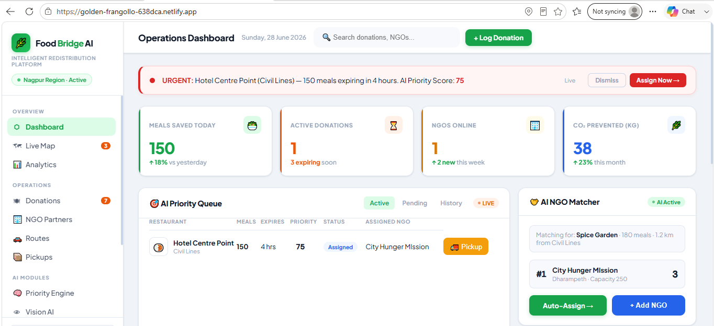

# FoodBridge AI - Project Gallery

This gallery showcases the major modules and user interface of the **FoodBridge AI – Intelligent Food Waste Redistribution Platform**.

---

# 1. Operations Dashboard

### Description

The Operations Dashboard is the main screen of the application.

It provides a complete overview of the food redistribution process, including:

- Total meals rescued
- Active donations
- NGOs currently available
- CO₂ emissions prevented
- AI Priority Queue
- AI NGO Matcher
- Live alerts for food nearing expiry

This dashboard helps administrators monitor the entire redistribution process in real time.

---

# 2. AI Analysis Module

### Description

The AI Analysis module displays the intelligent predictions generated by the system.

It includes:

- Vision AI food recognition
- Estimated servings prediction
- Tomorrow's food demand forecast
- Weekly meals rescued statistics
- Spoilage risk analysis

This module helps NGOs prioritize food collection before it expires.

---

# 3. Live Map & Activity

### Description

The Live Map module provides real-time tracking of food transportation.

Features include:

- Donor location
- NGO location
- Pickup vehicle tracking
- Route visualization
- Live activity feed
- Food rescued statistics
- People fed
- CO₂ reduction
- Waste reduction percentage

This enables efficient coordination between food donors and NGOs while ensuring faster food delivery.

